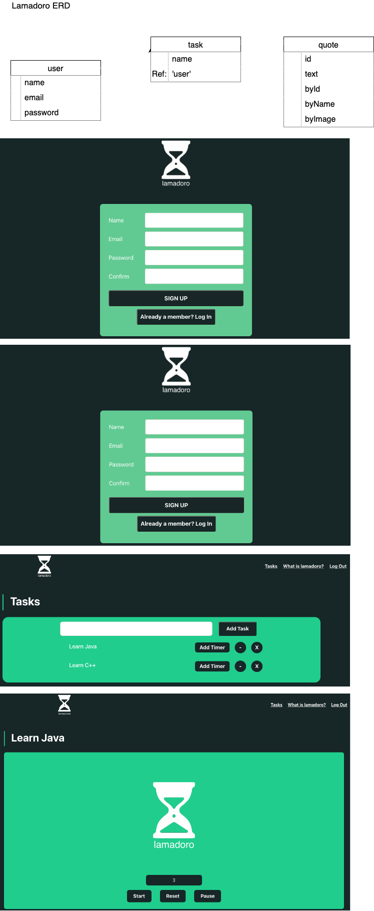

# Planning for Lamadoro app

 Lamadoro is a simple and intuitive app that combines the power of the Pomodoro Technique with a timer features to optimize your work sessions. You can divide your work into manageable intervals and take regular breaks to recharge and refocus. You will be given an inspiring quote afer each session that helps you get motivated and stay focused.  By following this structured approach, you'll experience improved productivity and reduced burnout.

## Wireframes the UI◊

   Trello Link:
   https://trello.com/b/j0ll7ZRu/lamadoro

## Technologies I used:
- HTML
- CSS
- React
- Express
- MongoDB

# Getting Started:
Check out your pomodoro app:

https://lamadoro-api.onrender.com

## Next Steps:
-  Add a page for the user to see all their completed tasks. They will see a button on tasks page for each task that can mark that task as completed and it will show on the completed tasks page.