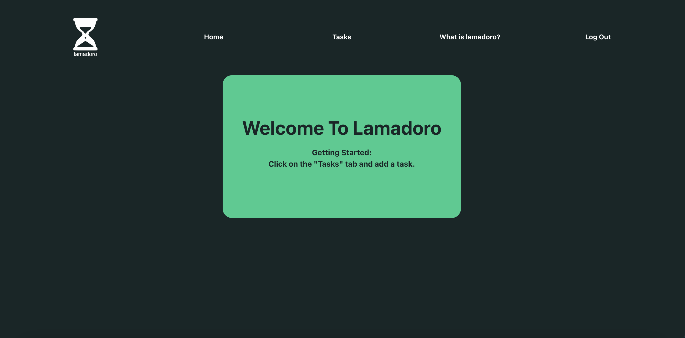
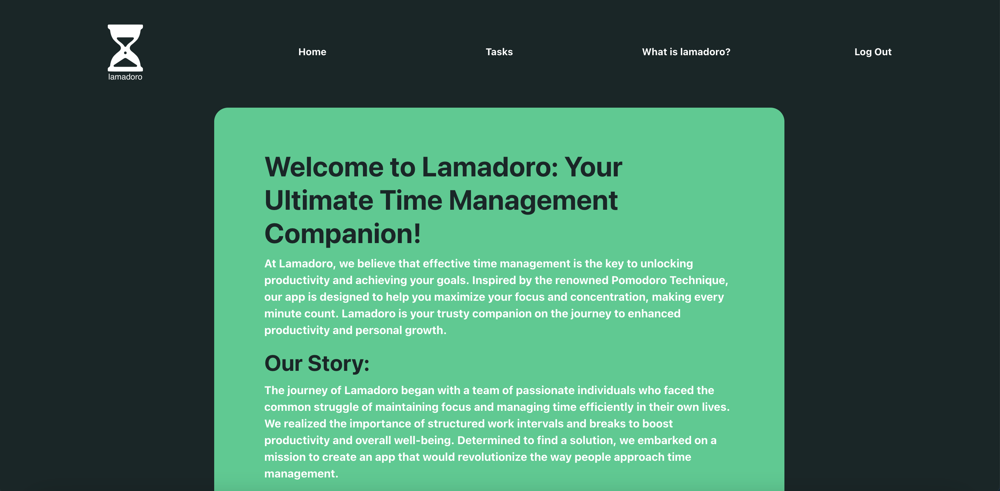
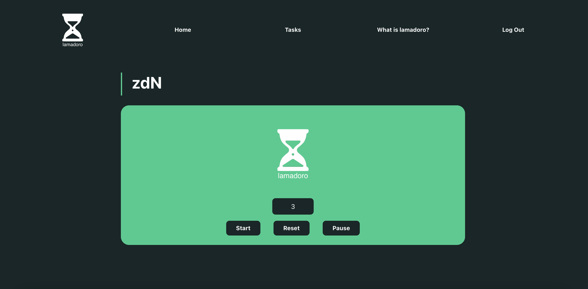

# Lamadoro

Lamadoro is a simple and intuitive app that harnesses the power of the Pomodoro Technique to optimize your work sessions. You can divide your work into manageable intervals and take regular breaks to recharge and refocus. You will be given an inspirational quote afer each completed session to help keep you motivated. By following this structured approach, you'll experience improved productivity and reduced burnout.

## Screenshots

Signup
Login
Welcome
About
Tasks
Timer

Trello Link:
https://trello.com/b/j0ll7ZRu/lamadoro

## Technologies Used:

-  HTML
-  CSS
-  React.js
-  Express
-  MongoDB
-  Mongoose
-  Node.js
-  Bootstrap/React Bootstrap
-  Canva
-  Figma
-  Pixabay

# Getting Started:

Check out our pomodoro app:

https://lamadoro-api.onrender.com

## Next Steps:

-  Add a check box for completing a task on the TaskListPage and the TaskDetailPage
-  Display the completed tasks on a CompletedTasksPage.
